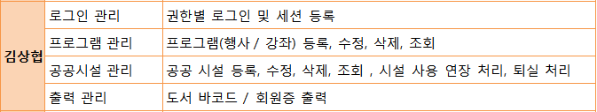

# Lifrary

팀프로젝트 github주소  :[팀작업 github바로가기](https://github.com/shohye/Lifrary)  
프로젝트 주소 :  [프로젝트 바로가기](http://tkdguq93.cafe24.com)

* 프로젝트명  
 전국민 독서량 증진과 도서관 방문율을 향상시키는 **도서관통합관리시스템( Lifrary )**  
  
* 개발 기간  
> 2019-10-24 ~ 2019-11-01  
&ensp;프로젝트 주제 선정 및 사전조사

> 2019-11-02 ~ 2019-12-01  
&ensp;프로젝트 설계(기능정의, 테이블 구상)  
&ensp;설계자료 취합, 수정 및 보완  
&ensp;ERD 작업 및 메서드, 패키지 정리

> 2019-12-02 ~ 2019-12-03  
&ensp;서버 설정  
&ensp;개발환경 설정  
&ensp;Hosting 설정

> 2019-12-03 ~ 2020-01-09  
&ensp;기능 구현(개인 분담 프로그래밍)

> 2019-12-30 ~ 2020-01-09  
&ensp;테스트, 오류 수정 및 보완

> 2020-01-10 ~ 2020-01-13  
&ensp;결과 보고서 작성

  
*  개발 목표  
&ensp;&ensp;1. 개인 독서 공간 제공과 목표량 및 포인트 제도를 도입하여 지속적인 독서량 증진과 도서관 방문을 늘리게 한다.  
&ensp;&ensp;2. 도서관리 단순화와 일괄된 도서관페이지 관리 시스템으로 효율적이고 통일된 관리를 목표로 한다.  
&ensp;&ensp;3. 전국 도서관간의 데이터를 공유하여 다양한 통계와 자료를 제공할 수 있다.  

  
* 기대 효과  
&ensp;&ensp;1. 나만의 독서공간을 마련하여 독서 상황을 기록할 수 있으며, 포인트 제도를 도입하여  도서관사이트를 지속적으로 이용하게 할 수 있다.  
&ensp;&ensp;2. 도서정보 반입과 도서관에 따른 청구기호 생성 등 간편한 도서 등록 시스템으로 빠른 작업이 가능하며, 적은 인원으로도 도서관리를 할 수 있다.  
&ensp;&ensp;3. 다양한 문화행사, 강좌 제공 및 편리한 공공시설 예약시스템으로 이용자가 증가하는것을 기대할 수 있다.  

* 내가 맡은 구현 기능  

